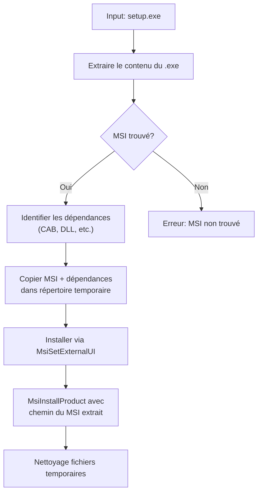

# Windows Installer Probe

A Qt-based application that replicates the Windows Installer UI GUI/CLI by integrating with the Microsoft Installer (MSI) API.

## Overview

This application provides a custom installation UI that works with an EXE bootstrapper, automatic extraction
and installation of embedded MSI packages by intercepting MSI installation callbacks.

## Supported Formats

✅ **Fully Supported:**
- MSI-based bootstrappers with extraction support (common setup.exe files)

⚠️ **Limited Support:**
- Some self-extracting archives (depends on format)

❌ **Not Supported:**
- Native InstallShield installers (non-MSI)
- NSIS installers
- Inno Setup installers

## Flowchart

